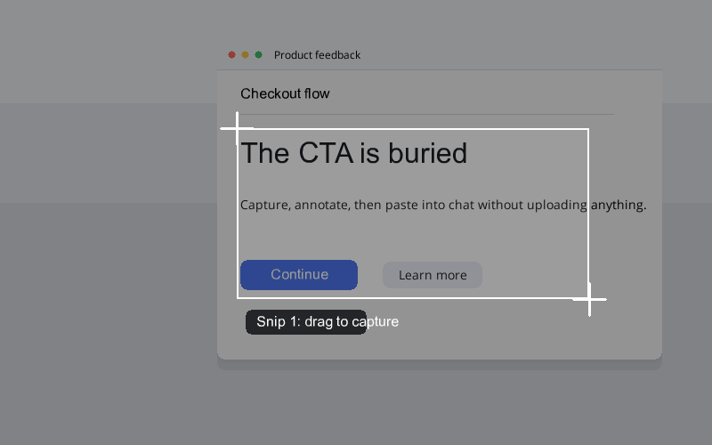

# Snip Pilot

**Screenshot. Annotate. Paste. No cloud.** A free, local-first macOS snipping app with your own global shortcut, scrolling capture, and zero telemetry.



Snip Pilot is a local-first macOS desktop app for fast snipping, floating quick access, annotation, scrolling capture, and clipboard handoff. It is designed for people who want to capture UI feedback while working and paste the result into a chat, issue, document, or agent workflow without uploading anything to a hosted service.

## Why Snip Pilot

- **Your shortcut, your call.** Choose the global hotkey on first run. Press once to snip, press twice for a scrolling capture.
- **One keypress to paste.** Snip → annotate → close the editor → it is already on your clipboard.
- **One local folder.** Every snip is a plain PNG in the folder you pick at setup. No accounts, no sidecar files.
- **Local-only, by design.** No cloud, no telemetry, no analytics, no CDN, and no snip uploads. The capture/editor windows block network requests; the only network path is a user-clicked update check to GitHub Releases.

## Download

Download the latest Apple Silicon macOS build from GitHub Releases:

- [Latest Snip Pilot release](https://github.com/kaptainkoder/SnipPilot---macOS/releases/latest)

The DMG is ad-hoc signed for a stable local app identity, but it is not Apple Developer ID notarized. macOS may require right-clicking the app and choosing Open on first launch.

## Features

- Global `Cmd+2` snip shortcut while the app is running.
- Press `Cmd+2` once for a normal snip, or press `Cmd+2` twice quickly for a scrolling snip.
- Native macOS drag-to-snip capture.
- Floating quick-access stack for pending snips.
- Full editor opened by clicking a floating snip.
- Annotation tools: pen, highlighter, line, arrow, rectangle, circle, redaction, numbered step marker, text box, eraser, undo, and reset.
- Text entry directly on the snip canvas.
- Object-aware eraser for removing annotations without damaging screenshot pixels.
- Auto-copy to clipboard when the editor is closed.
- Controlled scrolling capture: select a region, scroll the page, then click `Add above`, `Add below`, or `Auto capture` before stitching.
- Scroll stitching detects up/down movement and removes repeated stable headers or footers when it can identify them.
- First-run local setup for choosing the storage folder and global shortcut.
- Clean local library grouped by date with filters for all, today, week, and month.
- Local-only storage with no backend, telemetry, analytics, CDN assets, or auto-upload.

## How It's Built

- **Electron + vanilla JS** (`src/main.js`), packaged for Apple Silicon with `electron-builder`
  and shipped as an ad-hoc-signed DMG via GitHub Releases.
- **Scroll stitching engine** (`src/scroll-stitch.js`) — detects scroll direction between
  captures and de-duplicates stable headers/footers before compositing the long screenshot.
- **Security hardening** — restrictive CSP in every renderer, popups and external navigation
  blocked, renderer permission requests denied, and macOS entitlements that explicitly
  declare what the app does *not* access (camera, mic, Bluetooth).
- **Tested** — core logic covered with `node --test`; syntax gate via `npm run check`.

## Local Storage

Snips are stored in a single local folder:

```text
~/Documents/Codex Projects/SnipPilotSnips/
  Pending/
  Copied/
```

You can override the storage directory:

```sh
SNIP_PILOT_STORAGE_DIR="/path/to/SnipPilotSnips" npm start
```

Storage behavior:

- New snips are auto-saved as one PNG in `Pending`.
- Closing the editor saves the edited PNG and copies it to the clipboard.
- The floating snip remains in `Pending` so it can be reopened and edited again.
- Clicking the small `x` on a floating snip copies it and moves it into `Copied`.
- `Discard` deletes a pending snip completely.
- No JSON, Markdown, cloud sync, or hidden sidecar files are written by the app.

## Local Setup

On first launch, Snip Pilot opens a local setup panel. Choose:

- The local folder where all snips should be stored.
- The global capture shortcut, such as `Cmd+2`, `Cmd+Shift+2`, or `Cmd+Option+2`.

The app keeps this configuration in the local macOS application support folder. It is not uploaded.

## Privacy And Security

- Everything runs locally on your Mac.
- Renderer windows use a restrictive Content Security Policy.
- External navigation and popups are blocked.
- Renderer permission requests are denied.
- Renderer network requests are blocked except local `file:`, `data:`, and developer-tool URLs. The tray's `Check for Updates...` action contacts GitHub Releases only when you click it.
- Clipboard writes are local macOS clipboard writes. Other local apps with clipboard access may be able to read copied images.
- Screen & System Audio Recording permission is required by macOS for screenshot apps. Snip Pilot does not record audio; the permission name is controlled by macOS.
- The app bundle identity is `local.snippilot.app`. If macOS previously listed this project as `Electron`, remove or ignore that old entry and grant permission to `Snip Pilot.app`.
- Replacing an ad-hoc signed local build can make macOS ask for Screen & System Audio Recording again. Grant the permission once after installing the final app build you plan to use.
- Scrolling capture does not control the target app. You scroll manually, then explicitly add each view from the floating Snip Pilot controls.
- Snips are not encrypted at rest. Anyone with access to your macOS account or backups that include the storage folder may be able to read them.

## Install And Run

```sh
npm install
npm start
```

## Package The Desktop App

```sh
npm run pack
```

The packaged macOS app is created under:

```text
release/signed-mac-arm64/Snip Pilot.app
```

To build a shareable DMG:

```sh
npm run dist
```

The DMG is created under `release/` and copied into `downloads/` with a SHA-256 checksum. DMGs are published as GitHub Release assets instead of normal Git-tracked files because current builds can exceed GitHub's 100 MB file limit.

## Use It

1. Start Snip Pilot.
2. Press `Cmd+2` once or click `New snip`.
3. Drag a region.
4. Click the floating snip to edit.
5. Add annotations.
6. Click `Copy & close` or close the editor window.
7. Paste the copied image wherever you need it.

For scrolling capture:

1. Press `Cmd+2` twice quickly or click `Scroll snip`.
2. Drag the visible region you want to capture.
3. Scroll the target app/window normally.
4. Click `Add below` to add the current view below, or `Add above` to add the current view above.
5. Repeat scroll-and-add until you have the full capture, or click `Auto capture` and scroll slowly until ready.
6. The stitched image appears as a pending snip.

If you start near the top and scroll down, the final image is ordered top-to-bottom. If you start near the bottom and scroll up, the final image keeps the bottom content at the bottom.

## Limitations

- Scrolling capture is best-effort. macOS does not expose a universal scrolling screenshot API for every app.
- Stable fixed headers or footers are cropped from middle frames when Snip Pilot can identify them. Highly dynamic headers can still repeat, so selecting the content area below sticky headers remains the cleanest option.
- Highly dynamic pages, sticky headers, lazy-loaded content, and animations can reduce stitch quality.

## Development Notes

- Source lives in `src/`.
- Generated app bundles, local snips, and dependencies are ignored by Git.
- The app currently targets macOS.

## Support

Snip Pilot is free and open source (MIT). If it is useful to you, a GitHub star helps me know it is worth continuing to build — and feedback via [issues](https://github.com/kaptainkoder/SnipPilot---macOS/issues) is even more welcome.
